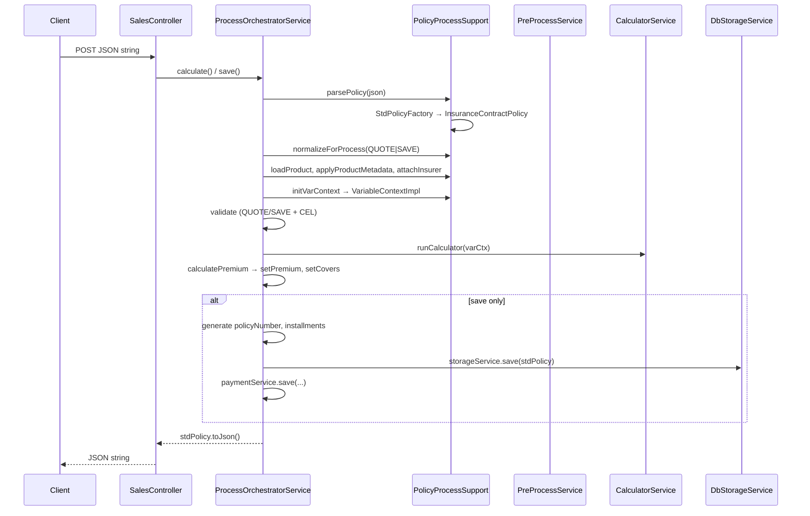
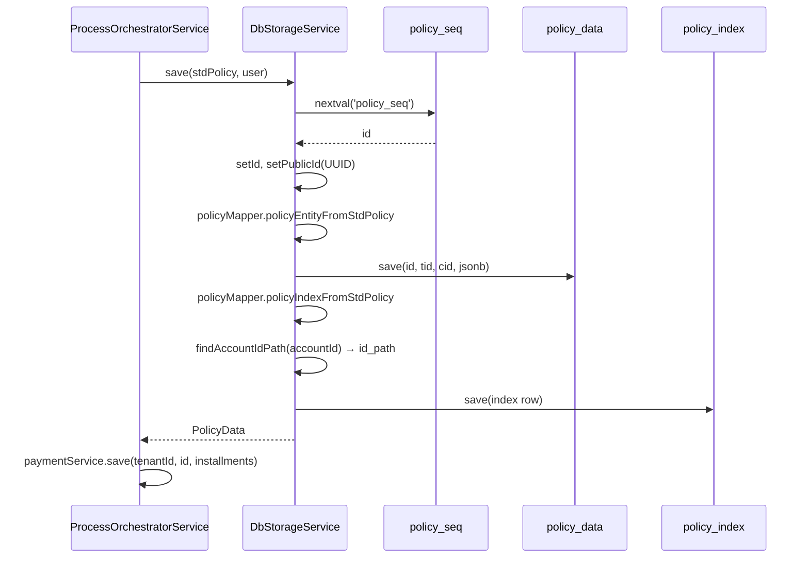

# Quote / Save: поток обработки договора

Документ описывает, как запросы **quote** (расчёт котировки) и **save** (оформление договора) проходят через API, оркестратор, калькулятор и хранилище; какие форматы данных используются на каждом этапе; как договор записывается в БД и читается обратно.

Pluggable wire-форматы и adapter-JAR: [POLICY_WIRE_ADAPTERS.md](./POLICY_WIRE_ADAPTERS.md).

---

## API-эндпоинты

| Метод | URL | Контроллер | Оркестратор |
|-------|-----|------------|-------------|
| `POST` | `/api/v1/{tenantCode}/sales/quotes` | `SalesController.quoteValidator` | `ProcessOrchestrator.calculate` |
| `POST` | `/api/v1/{tenantCode}/sales/policies` | `SalesController.saveValidator` | `ProcessOrchestrator.save` |
| `GET` | `/api/v1/{tenantCode}/sales/policies/{policyNumber}` | `SalesController.getPolicyByNumber` | `ProcessOrchestrator.getPolicyByNumber` |

Тело запроса quote/save — **сырой JSON-строкой** (`@RequestBody String`), не типизированный объект Spring.

Ответ quote/save — тоже **JSON-строка** (сериализованный договор после обработки).

---

## Слои и пакеты

```
HTTP JSON
    │
    ▼
SalesController (pt-launcher)
    │
    ▼
ProcessOrchestratorService (pt-process)     ← оркестратор
    ├── PolicyProcessSupport                ← общие шаги parse / product / vars / commission
    ├── PreProcessService                   ← нормализация, даты, метаданные продукта
    ├── ValidatorService                    ← валидаторы продукта (QUOTE / SAVE)
    ├── RuleValidationService (CEL)         ← PRE/POST quote/save rules
    ├── CalculatorService (pt-calculator)   ← тарифный расчёт
    ├── PostProcessService                  ← запись премий/лимитов в покрытия
    ├── NumberGeneratorService              ← только save
    ├── PaymentService                      ← только save (график платежей)
    └── StorageService → DbStorageService   ← только save (pt-db)
```

### Форматы данных

| Слой | Тип | Назначение |
|------|-----|------------|
| Wire JSON | `ru.pt.api.dto.policyv3.PolicyDTO` | Схема API и JSON в БД |
| Домен процесса | `ru.pt.api.dto.policy.StdPolicy` | Единый интерфейс для quote/save/storage |
| Реализация | `InsuranceContractPolicy`* | Обёртка: `PolicyDTO` + runtime-переменные; `formatId` = `v3` |

\* целевое имя при рефакторинге: `V3Policy` в `pt-adapter-v3`.
| Domain-view | `ru.pt.api.dto.policy.*` (`InsuredObject`, `Cover`, `Commission`, …) | Типизированный доступ в оркестраторе |
| Переменные расчёта | `VariableContextImpl` (`CalculatorContext`) | JsonPath → vars, калькулятор, CEL |
| Хранилище | `PolicyData` + `policy_data` / `policy_index` | DTO передачи; JSONB + денормализованный индекс |

**Важно:** отдельного «std JSON»-формата нет. `StdPolicy` — Java-абстракция. В БД и в ответе API лежит **wire JSON** (`policyv3.PolicyDTO`), но уже обогащённый процессом (премия, номер, id, commission, installments и т.д.).

---

## Общая схема (quote и save)



---

## Шаг 1. Парсинг запроса → StdPolicy

```java
// PolicyProcessSupport.parsePolicy
stdPolicyFactory.build(StdPolicyFormat.INSURANCE_CONTRACT, json)
```

Цепочка:

1. `StdPolicyRegistry` находит `InsuranceContractStdPolicyMapper`.
2. `InsuranceContractPolicy.fromJson(json)`:
   - `PolicyJsonSupport.fromJson(json)` → `PolicyDTO` (wire);
   - создаётся `InsuranceContractPolicy(contract, sourceJson)`.

На этом этапе `PolicyDTO` живёт **только внутри** `InsuranceContractPolicy`. Внешний код работает с `StdPolicy`.

---

## Шаг 2. Нормализация (PreProcessService)

`PolicyProcessSupport.normalizeForProcess(stdPolicy, processList, dataScope)`:

| Поле / действие | Значение |
|-----------------|----------|
| `processList.processType` | `"quote"` или `"save"` |
| `processList.dataScope` | `"DEV"` (если у пользователя dataScope=DEV) или `"PROD"` |
| `premium` | `null` (пересчитывается) |
| `policyNumber` | `null` (на save генерируется позже) |
| `productVersion` | `0` (перезапишется из продукта) |
| `id` | `null` |
| `statusCode` | `"NEW"` |

---

## Шаг 3. Продукт, авторизация, метаданные

Общие для quote и save:

1. **Продукт** — `productService.getProductByCode(tenantId, productCode, isDev)`.
2. **Авторизация:**
   - quote: `PRODUCT::QUOTE`;
   - save (PROD): `POLICY::SELL` + `PRODUCT::SELL`.
3. **Метаданные** — `PreProcessService.applyProductMetadata`:
   - `productVersion`, `productName`;
   - нормализация дат (`issueDate`, `startDate`, `endDate`, `policyTerm`, `waitingPeriod`);
   - инициализация покрытий/франшиз по конфигурации продукта.
4. **Страховщик** — `InsurerMapper.fromInsuranceCompany(...)`.
5. **Комиссия** — проверка запрошенной ставки (`CommissionService.checkRequestedCommissionRate`).

---

## Шаг 4. Контекст переменных (VariableContext)

`PolicyProcessSupport.initVarContext(stdPolicy, product)`:

```java
policy.setVars(product);           // InsuranceContractPolicy.rebuildVariableContext()
CalculatorContext varCtx = policy.asCalculatorContext();
preProcessService.enrichVariables(varCtx);
```

Внутри `setVars`:

1. `syncViewsToContract()` — domain-view → `PolicyDTO`;
2. `sourceJson = PolicyJsonSupport.toJson(contract)`;
3. `VariableContextImpl.builder().json(sourceJson).productVersion(product).build()`:
   - по jsonPath из определений переменных продукта материализуются значения из JSON;
   - вычисляются MAGIC-переменные (`ph_age_issue`, `pl_TermMonths`, …).

Дальше оркестратор, калькулятор и CEL работают с `varCtx`, а изменения системных полей договора — через геттеры/сеттеры `StdPolicy` (`setPremium`, `setStartDate`, …).

---

## Шаг 5. Валидация

| Этап | quote | save |
|------|-------|------|
| `ValidatorService` QUOTE | ✓ | ✓ |
| `ValidatorService` SAVE | — | ✓ |
| CEL `PRE_QUOTE_VALIDATION` | ✓ | ✓ |
| CEL `PRE_SAVE_VALIDATION` | — | ✓ |
| CEL `POST_QUOTE_VALIDATION` | ✓ (после расчёта) | — |
| CEL `POST_SAVE_VALIDATION` | — | ✓ (перед записью в БД) |

Дополнительно на quote: `PolicyAddOnService.checkRequestedAddOns` — проверка и нормализация опций.

При ошибках — `UnprocessableEntityException` со списком `ValidationError`.

---

## Шаг 6. Расчёт премии (калькулятор)

`ProcessOrchestratorService.calculatePremium`:

1. **Обязательные vars покрытий** — для каждого cover регистрируются `io_{code}_sumInsured`, `io_{code}_premium`, `io_{code}_deductibleNr`.
2. **Калькулятор** — `calculatorService.getCalculator(tenantId, productId, versionNo, packageCode)`.
3. Если калькулятор найден:
   - `calculatorService.runCalculator(...)` — выполнение формул, запись результатов в `varCtx`;
   - `postProcessService.setCovers(insuredObject, varCtx)` — премия/СС/франшиза/лимиты из vars в domain `Cover`.
4. **Премия договора:**
   - если `varCtx.pl_premium > 0` → `stdPolicy.setPremium(pl_premium)`;
   - иначе сумма `cover.premium` по покрытиям.
5. **СС объекта** — из `io_sumInsured` в vars → `insuredObject.setSumInsured(...)`.

`CalculatorServiceImpl.runCalculator` загружает модель калькулятора (формулы, коэффициенты), добавляет CONST-переменные в контекст и последовательно выполняет строки формулы с условиями.

---

## Шаг 7. Постобработка (общая)

После расчёта:

1. **Digests** — `TextDocumentView` пишет `ph_digest`, `io_digest` в `processList` (на save ещё `insCompanyCode`).
2. **Комиссия** — `commissionService.calculateCommission` → `stdPolicy.setCommission(...)`.
3. **quote:** `assertPositivePremium`, для PROD — `processList` убирается из ответа, `return stdPolicy.toJson()`.

---

## Шаг 8. Только save — оформление и запись

Дополнительные шаги после расчёта:

| # | Действие | Сервис |
|---|----------|--------|
| 1 | Генерация номера договора | `NumberGeneratorService.getNextNumber` |
| 2 | График платежей | `PaymentService.createInstallments` → `stdPolicy.setInstallments` |
| 3 | CEL POST_SAVE_VALIDATION | `RuleValidationService` |
| 4 | Сохранение в БД | `StorageService.save(stdPolicy, user)` |
| 5 | Сохранение платежей | `PaymentService.save(tenantId, policyId, installments)` |
| 6 | Ответ | `processList = null`, `stdPolicy.toJson()` |

После `storageService.save` на `stdPolicy` проставлены `id` и `publicId` (используются в `paymentService.save`).

---

## Сериализация ответа (toJson)

`InsuranceContractPolicy.toJson()`:

1. `syncViewsToContract()` — domain `InsuredObject` / `Commission` / `Installment` → поля `PolicyDTO`;
2. `PolicyJsonSupport.toJson(contract)` — Jackson, pretty-print, `@JsonInclude(NON_EMPTY)`.

`processList` в ответе:
- **quote + PROD** — убирается (`stripProcessListForProdResponse`);
- **save** — убирается перед ответом (`setProcessList(null)`);
- **quote + DEV** — может остаться в JSON.

---

## Хранение в БД

Запись в БД выполняется **только на save**. Quote не персистится — расчёт остаётся в памяти и уходит клиенту в ответе.

Реализация: `StorageService` (интерфейс, `pt-api`) → `DbStorageService` (`pt-db`). Миграции схемы — `pt-launcher/src/main/resources/db/migration/`.

### Модель: две связанные таблицы

Договор хранится в **разделённой** схеме:

| Таблица | JPA-сущность | Назначение |
|---------|--------------|------------|
| `policy_data` | `PolicyEntity` | Полный документ договора (JSONB) |
| `policy_index` | `PolicyIndexEntity` | Денормализованный индекс для поиска, списков, отчётов и платежей |

Связь **1:1** по полю `id` (общий первичный ключ):

```
policy_seq ──► policy_data.id  ◄──FK──  policy_index.id
                      │                      │
                      └── policy (jsonb)     └── public_id, policy_nr, premium, …
```

`policy_index.id` ссылается на `policy_data.id` с `ON DELETE CASCADE`. При удалении строки в `policy_data` индекс удаляется автоматически.

Дополнительно `policy_index` используется как FK в `po_addon_policies` (опции к договору).

### Идентификаторы

| Поле | Где | Тип | Назначение |
|------|-----|-----|------------|
| `id` | обе таблицы | `BIGINT` | Внутренний PK; выдаётся из последовательности `policy_seq` (старт с 1000) |
| `public_id` | `policy_index` | `UUID` | Внешний идентификатор договора; попадает в JSON как `publicId`; используется в платежах и API |
| `policy_nr` | `policy_index` + JSON | `VARCHAR(30)` | Бизнес-номер договора; уникален в рамках тенанта: `UNIQUE (tid, policy_nr)` |

На save:

1. `policyRepository.getNextPolicySeqValue()` → `policy.setId(id)`;
2. если `publicId` пуст — `UUID.randomUUID()` → `policy.setPublicId(...)`;
3. тот же `id` проставляется в `PolicyEntity` и `PolicyIndexEntity`.

`paymentService.save` после записи в БД использует уже проставленные `stdPolicy.getId()` и `publicId`.

### Схема `policy_data`

| Колонка | Тип | Источник при save |
|---------|-----|-------------------|
| `id` | `BIGINT PK` | `policy_seq` |
| `tid` | `BIGINT` | `userData.getTenantId()` |
| `cid` | `BIGINT` | `userData.getClientId()` |
| `policy` | `JSONB NOT NULL` | `policy.toJson()` (wire `PolicyDTO`) |

Hibernate маппит `policy` как `String` с `@JdbcTypeCode(SqlTypes.JSON)`.

### Схема `policy_index`

Полный перечень колонок, заполняемых при первичном save (`PolicyMapper.policyIndexFromStdPolicy`):

| Колонка | Источник (`StdPolicy` / контекст) |
|---------|-----------------------------------|
| `id` | тот же `id`, что у `policy_data` |
| `public_id` | `policy.getPublicId()` |
| `tid` | `userData.getTenantId()` |
| `policy_nr` | `policy.getPolicyNumber()` |
| `version_no` | `1` (при save) |
| `top_version` | `true` |
| `product_code` | `policy.getProductCode()` |
| `document_format` | `policy.getFormat()` → `v3` (см. [POLICY_WIRE_ADAPTERS.md](./POLICY_WIRE_ADAPTERS.md)) |
| `product_version_no` | `policy.getProductVersion()` |
| `create_date` | `ZonedDateTime.now()` |
| `issue_date` | `policy.getIssueDate()` |
| `payment_date` | `null` (заполняется при оплате) |
| `start_date`, `end_date` | из договора |
| `user_account_id` | `userData.getAccountId()` |
| `client_account_id` | `userData.getClientId()` |
| `id_path` | путь аккаунта из `acc_accounts.id_path` (обязателен для иерархического поиска) |
| `data_scope` | `processList.dataScope` (`DEV` / `PROD`) |
| `policy_status` | `PolicyStatus.valueOf(policy.getStatusCode())` — при save обычно `NEW` |
| `payment_order_id` | `null` (позже — `setPaymentOrderId`) |
| `ins_company` | `policy.getInsurer().getCode()` |
| `ph_digest`, `io_digest` | из `processList` (до обнуления `processList` в ответе) |
| `user_login` | `userData.getUsername()` |
| `premium` | `policy.getPremium()` |
| `agent_kv_percent` | `commission.appliedCommissionRate` |
| `agent_kv_amount` | `commission.commissionAmount` |

`document_format` хранит **`formatId`** (напр. `v3`) — тот же идентификатор, что в URL `/{formatId}/quotes`. Нужен при чтении: `PolicyData.resolveDocumentFormat()` → `StdPolicyRegistry.fromStorage()`. Подключение форматов — [POLICY_WIRE_ADAPTERS.md](./POLICY_WIRE_ADAPTERS.md).

`id_path` — материализованный путь в дереве `acc_accounts`; по префиксу `id_path` строятся списки договоров поддерева и дашборды без JOIN к полному JSON.

### Запись при save (поток)



Порядок в `DbStorageService.save`:

1. Выделить `id`, сгенерировать `publicId` при необходимости.
2. Сериализовать JSON → `policy_data` (`tid`, `cid` из сессии пользователя).
3. Построить индекс → подставить `id_path` → `policy_index`.
4. Вернуть `PolicyData` (индекс + JSON + дублирующие поля верхнего уровня).

Транзакция: метод `save` не помечен `@Transactional` на уровне класса; при ошибке на шаге индекса возможна рассинхронизация — на практике оба `save` вызываются последовательно в одном HTTP-запросе save.

### Формат JSON в `policy_data.policy`

Это **не отдельный std-формат**, а сериализованный **`policyv3.PolicyDTO`**:

```java
// PolicyMapper.policyEntityFromStdPolicy
ProcessList processList = policy.getProcessList();
policy.setProcessList(null);           // runtime-поле не сохраняется
String policyJson = policy.toJson();
policy.setProcessList(processList);    // восстанавливается in-memory
```

Отличия сохранённого JSON от сырого запроса:

- заполнены `id`, `publicId`, `policyNumber`, `premium`, `productVersion`, `commission`, `installments`, `insurer`, `statusCode`, даты;
- **`processList` отсутствует** в БД;
- JSON pretty-printed (`PolicyJsonSupport`, `@JsonInclude(NON_EMPTY)`).

Индекс дублирует ключевые поля, чтобы списки, фильтрация, дашборды и callback платежей работали **без разбора JSONB**.

### DTO `PolicyData`

Единый контейнер для передачи договора между слоями (`pt-api`):

| Поле | Содержимое |
|------|------------|
| `policyId` | `UUID` = `policy_index.public_id` |
| `policyNumber` | `policy_index.policy_nr` |
| `policyStatus` | `PolicyStatus` из индекса (`NEW`, `IN_PAYMENT`, `PAID`) |
| `policyIndex` | проекция `PolicyIndex` (даты, продукт, аккаунты, `documentFormat`, …) |
| `policy` | сырая JSON-строка из `policy_data.policy` |
| `parameterMap` | опциональная проекция (не используется в quote/save pipeline) |

`resolveDocumentFormat()` — читает `policyIndex.documentFormat`; fallback `v3` (миграция V12 с `INSURANCE_CONTRACT`).

---

## Чтение из БД

### API `StorageService`

| Метод | Поиск | Возврат |
|-------|-------|---------|
| `getPolicyByNumber(policyNumber)` | `policy_index.policy_nr` | `PolicyData` |
| `getPolicyById(publicId)` | `policy_index.public_id` | `PolicyData` |
| `getPolicyByPaymentOrderId(paymentOrderId)` | `policy_index.payment_order_id` | `PolicyData` |
| `getPoliciesForUser()` | `client_account_id` + `user_account_id` текущего пользователя | `List<PolicyData>` |
| `getAccountQuotes(qstr)` | по `id_path` поддерева + `POLICY::LIST`; фильтр по `policy_nr` / `ph_digest` | `List<QuoteDto>` |

Внутренний алгоритм `getPolicyData`:

1. Найти строку в `policy_index`.
2. `policyRepository.findById(index.id)` → JSON из `policy_data`.
3. Собрать `PolicyData` через `PolicyMapper.toDto(index)`.

Если индекс есть, а JSON в `policy_data` отсутствует — `InternalServerErrorException` (нарушение целостности 1:1).

### API GET policy

```
GET /api/v1/{tenantCode}/sales/policies/{policyNumber}
  → ProcessOrchestrator.getPolicyByNumber
  → StorageService.getPolicyByNumber
  → DbStorageService.getPolicyData
```

Оркестратор дополнительно проверяет, что `userAccountId` и `clientAccountId` индекса совпадают с текущим пользователем (`403` при несовпадении).

Клиент получает JSON договора в поле `policy` как есть из БД (wire format v3). Дополнительная десериализация на уровне контроллера **не выполняется**.

### Восстановление `StdPolicy` из хранилища

Для внутренней логики (печать, платежи, повторный процесс):

```java
// StdPolicyRegistry.fromStorage(PolicyData policyData)
stdPolicyFactory.build(policyData.resolveDocumentFormat(), policyData.getPolicy())
  → InsuranceContractStdPolicyMapper.fromJson(json)
  → PolicyJsonSupport.fromJson(json) → PolicyDTO
```

Формат маппера берётся из **`policy_index.document_format`**, не захардкожен.

После `fromJson` переменные (`VariableContext`) **не инициализированы** — нужен `policy.setVars(product)` перед расчётом/валидацией, как при новом запросе.

### Обновление (`update`)

`DbStorageService.update(PolicyData)` — точечное обновление существующего договора:

**`policy_index`** (из `policyData.policyIndex`):

- `policy_nr`, `version_no`, `policy_status`, `start_date`, `end_date`, `payment_order_id`

**`policy_data`**:

- полная замена колонки `policy` строкой `policyData.getPolicy()`

Типичный сценарий — callback оплаты (`ProcessOrchestratorService.paymentCallback`):

1. `getPolicyById(publicId)`;
2. через `JsonSetter` в JSON выставляется `"status": "PAID"`;
3. `policyData.setPolicyStatus(PolicyStatus.PAID)`;
4. `storageService.update(policyData)`.

Проверка «можно ли обновлять оплаченный договор» — ответственность вызывающего кода, не хранилища (см. комментарий в `StorageService`).

### Платежи и индекс

| Операция | Метод | Зачем |
|----------|-------|-------|
| Привязать платёж к договору | `setPaymentOrderId(policyNumber, paymentOrderId)` | YooKassa: найти договор по `payment_order_id` в webhook |
| Найти договор по платежу | `getPolicyByPaymentOrderId(paymentOrderId)` | `YoukassaCallbackController`, `YoukassaPaymentClient` |

`VskPaymentClient` и другие клиенты часто читают только сырой JSON: `getPolicyByNumber(...).getPolicy()` без обёртки `StdPolicy`.

### Поиск и отчёты без JSON

`policy_index` — основа для:

- списка договоров аккаунта (`getAccountQuotes`, `PolicyReport.findPoliciesByAccountPath`);
- агрегатов дашборда (`getDashboardCardsAggregates`, `getDashboardByProducts`, графики по `start_date`);
- фильтрации по `id_path LIKE prefix%` (вся ветка субагентов).

Полный JSON (`policy_data`) подгружается только когда нужен документ целиком.

---

## Сравнение quote и save

| | Quote | Save |
|---|-------|------|
| `processList.processType` | `quote` | `save` |
| Валидация SAVE | нет | да |
| CEL PRE/POST SAVE | нет | да |
| Add-ons check | да | нет (в текущем коде) |
| Номер договора | не генерируется | `NumberGeneratorService` |
| Installments | нет | `PaymentService` |
| Запись в БД | нет | `StorageService.save` |
| `assertPositivePremium` | да | нет (явно) |
| Авторизация PROD | QUOTE на продукт | SELL на policy + product |

---

## Ключевые классы (шпаргалка)

| Класс | Модуль | Роль |
|-------|--------|------|
| `SalesController` | pt-launcher | HTTP entrypoint |
| `ProcessOrchestratorService` | pt-process | Оркестрация quote/save |
| `PolicyProcessSupport` | pt-process | Общие шаги pipeline |
| `PreProcessService` | pt-process | Нормализация, даты, покрытия |
| `CalculatorServiceImpl` | pt-calculator | Тарифные формулы |
| `PostProcessService` | pt-process | Vars → Cover |
| `InsuranceContractPolicy` | pt-api | StdPolicy impl |
| `PolicyJsonSupport` | pt-api | JSON ↔ PolicyDTO |
| `PolicyDtoMapper` | pt-api | policyv3 ↔ policy domain |
| `VariableContextImpl` | pt-api | Runtime vars из JSON + product |
| `StorageService` | pt-api | Контракт хранилища (save / get / update) |
| `PolicyData` / `PolicyIndex` | pt-api | DTO договора и проекция индекса |
| `PolicyEntity` / `PolicyIndexEntity` | pt-db | JPA-сущности `policy_data` / `policy_index` |
| `DbStorageService` | pt-db | JPA persistence |
| `PolicyMapper` | pt-db | StdPolicy → Entity / Index; Entity → DTO |
| `StdPolicyRegistry` | pt-process | Фабрика StdPolicy по formatId |
| `PolicyFormatPlugin` | pt-api (план) | Wire + storage; см. [POLICY_WIRE_ADAPTERS.md](./POLICY_WIRE_ADAPTERS.md) |

---

## Границы ответственности PolicyDTO

`PolicyDTO` (`policyv3`) должен использоваться только как **wire-модель**:

- входящий/исходящий JSON;
- JSON в колонке `policy_data.policy`;
- внутреннее поле `InsuranceContractPolicy.contract`.

Оркестратор, storage API и маппер БД работают с **`StdPolicy`**. Domain-типы (`ru.pt.api.dto.policy.InsuredObject`, `Cover`, …) — для типобезопасной логики внутри процесса; перед сериализацией синхронизируются обратно в `PolicyDTO`.
