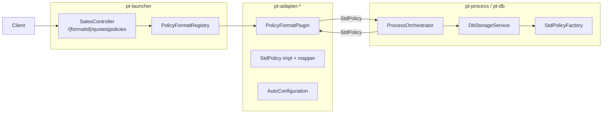

# Предпроект: pluggable API для внешних контрактов договора

Документ описывает, как вынести wire-форматы договора в отдельные JAR-модули, сохранив единый процесс quote/save на `StdPolicy`.

Связанный документ: [POLICY_QUOTE_SAVE.md](./POLICY_QUOTE_SAVE.md) — поток обработки и хранение в БД.

---

## Цели

1. Новый внешний контракт (JSON/XML/проприетарный API) подключается **отдельным JAR**, без правок `pt-process`.
2. Оркестратор, калькулятор, CEL, хранилище работают только с **`StdPolicy`**.
3. Один короткий идентификатор формата **`formatId`** — в URL, в коде, в `policy_index.document_format`.
4. Явно разделены сценарии: **новый продукт** (конфиг в БД) vs **новый формат** (код в JAR).

---

## Текущее состояние

```
Wire JSON  ──StdPolicyMapper──►  StdPolicy  ──ProcessOrchestrator──►  StdPolicy  ──►  БД (document_format)
```

| Компонент | Статус |
|-----------|--------|
| `StdPolicy`, `StdPolicyMapper`, `StdPolicyFactory` | есть в `pt-api` |
| `StdPolicyRegistry` | есть в `pt-process`, собирает все `StdPolicyMapper` beans |
| `ProcessOrchestrator.quote/save(StdPolicy)` | format-agnostic |
| `policy_index.document_format` | есть (V11) |
| `SalesController`, `PolicyProcessSupport` | захардкожен `INSURANCE_CONTRACT` |
| Реализация wire v3 (`InsuranceContractPolicy`*, `PolicyDTO`) | в `pt-api` вместе со SPI |

\* временное имя класса; при рефакторинге → `V3Policy` в `pt-adapter-v3`.

**Узкое место:** wire-реализация не вынесена в adapter-модуль; контроллер не параметризован по формату.

---

## Решения (согласовано)

### 1. Один `formatId` везде

Не вводить пару `adapterId` (URL) + `documentFormat` (БД). Один идентификатор:

```text
formatId = "v3"
```

| Место | Пример |
|-------|--------|
| URL | `POST /api/v1/{tenant}/sales/v3/quotes` |
| `StdPolicy.getFormat()` | `v3` |
| `policy_index.document_format` | `v3` |
| Реестр плагинов | `registry.get("v3")` |
| Константа в коде | `PolicyFormats.V3` → `"v3"` |

**Почему `v3`, а не `std`:** совпадает с пакетом `policyv3` и wire-моделью `PolicyDTO`. `std` путается с `StdPolicy` (внутренний контракт процесса, не wire).

Другие форматы — короткие id в camelCase: `partnerX`, `legacyXml`.

### 2. Именование

| Слой | Было | Стало |
|------|------|-------|
| `formatId` / URL / БД | `INSURANCE_CONTRACT`, `insuranceContract` | `v3` |
| Gradle-модуль | — | `pt-adapter-v3` |
| Plugin | — | `V3FormatPlugin` |
| `StdPolicy` impl | `InsuranceContractPolicy` | `V3Policy` (при переносе в adapter) |
| Wire DTO | `policyv3.PolicyDTO` | без переименования |

Существующее значение `INSURANCE_CONTRACT` (V11) — мигрировать в `v3` (см. ниже).

### 3. Продукт ≠ формат

| Что добавляется | Нужен JAR | Нужен redeploy launcher |
|-----------------|-----------|-------------------------|
| **Новый продукт** (`productCode` в БД) | нет | нет |
| **Новый формат** (другой wire-контракт) | да | зависит от способа подключения (см. Деплой) |

Продукт в `pt-product` использует уже подключённый `formatId`. Калькулятор, валидаторы, vars настраиваются в БД/админке.

---

## Целевая архитектура



**Принцип:** `pt-process` не зависит от конкретного формата. Формат = JAR с плагином.

---

## Модули (Gradle)

| Модуль | Зависимости | Содержимое |
|--------|-------------|------------|
| `pt-api` | jackson, slf4j | SPI: `StdPolicy`, `PolicyFormatPlugin`, `StdPolicyFactory` |
| `pt-adapter-v3` | `pt-api` | `PolicyDTO`, `V3Policy`, `V3FormatPlugin`, auto-config |
| `pt-adapter-<name>` | `pt-api` | новый формат (`partnerX`, …) |
| `pt-process` | `pt-api`, … | оркестратор, `StdPolicyRegistry` — без конкретных форматов |
| `pt-launcher` | `pt-process` + adapter-модули | HTTP, сборка |

---

## SPI: `PolicyFormatPlugin`

Единый интерфейс wire-границы и persistence.

```text
PolicyFormatPlugin
  formatId()              → "v3"
  parseRequest(String)    → StdPolicy
  writeResponse(StdPolicy)→ String          // тело HTTP-ответа
  fromJson(String)        → StdPolicy       // чтение из policy_data.policy
  toJson(StdPolicy)       → String          // запись в policy_data.policy
```

Для JSON-форматов `parseRequest` / `writeResponse` могут делегировать в `fromJson` / `toJson`. Для XML/бинарных — своя реализация parse/write, но на выходе процесса всё равно `StdPolicy`.

`StdPolicyMapper` — deprecated alias над `PolicyFormatPlugin` на время миграции.

### Реестр

```text
PolicyFormatRegistry
  require(formatId)           // из URL
  optional(formatId)
  all()                       // список подключённых форматов

StdPolicyRegistry (существующий)
  build(formatId, json)       // делегирует plugin.fromJson
  fromStorage(PolicyData)     // formatId = policyData.resolveDocumentFormat()
```

Оба реестра собирают `List<PolicyFormatPlugin>` из Spring context (in-repo beans + plugin path).

---

## HTTP API

### Эндпоинты

```text
POST /api/v1/{tenantCode}/sales/{formatId}/quotes
POST /api/v1/{tenantCode}/sales/{formatId}/policies
GET  /api/v1/{tenantCode}/sales/{formatId}/policies/{policyNumber}   // фаза 2
```

Пример: `POST /api/v1/pt/sales/v3/quotes`

### Обратная совместимость

Старые пути — alias на default-формат:

```text
POST /api/v1/{tenant}/sales/quotes
  → formatId = "v3"
```

### Контроллер (псевдокод)

```text
quote(formatId, body):
  plugin = registry.require(formatId)
  policy = plugin.parseRequest(body)
  result = orchestrator.quote(policy)
  return ResponseEntity.ok(plugin.writeResponse(result))
```

`ProcessOrchestrator` не знает про `formatId`.

### Привязка к продукту (фаза 2)

После `loadProduct` — опциональная проверка: `formatId` ∈ `product.supportedFormats`. На фазе 1 достаточно одного `v3`.

---

## Содержимое adapter-JAR

Пример `pt-adapter-v3`:

| Компонент | Роль |
|-----------|------|
| `V3Policy` | реализация `StdPolicy` |
| `PolicyDTO`, domain types | wire-модель (`policyv3`) |
| `V3FormatPlugin` | `PolicyFormatPlugin` |
| `V3AutoConfiguration` | `@Bean` plugin |
| `META-INF/spring/...AutoConfiguration.imports` | auto-discovery |

Зависимости adapter-JAR: **только `pt-api`**.

---

## Деплой: два режима

### Режим A — in-repo (фаза 1, по умолчанию)

```kotlin
// pt-launcher/build.gradle.kts
implementation(project(":pt-adapter-v3"))
// implementation("ru.pt:pt-adapter-partnerX:1.0.0")
```

| Действие | Достаточно? |
|----------|-------------|
| Новый продукт в БД | да, без redeploy |
| Новый adapter-JAR | **нет** — нужен rebuild `pt-launcher` + redeploy артефакта |
| Restart без rebuild | **не подхватит** новый JAR |

### Режим B — внешняя директория плагинов (фаза 2, опционально)

```text
adapters.path=/opt/pt/adapters     # env или application.yml
```

```text
/opt/pt/
  pt-launcher.jar
  adapters/
    pt-adapter-v3-1.0.jar
    pt-adapter-partnerX-1.0.jar
```

При старте launcher сканирует `adapters.path`, загружает JAR, регистрирует `PolicyFormatPlugin` beans.

| Действие | Достаточно? |
|----------|-------------|
| `cp new-adapter.jar /opt/pt/adapters/` + **restart** | да |
| Rebuild launcher | не нужен |

**Restart процесса обязателен** — Spring не подхватывает JAR на горячую.

### Сводка

| Вопрос | In-repo (A) | Plugin path (B) |
|--------|-------------|-----------------|
| Подложить JAR + restart | нет | да |
| Rebuild launcher | да | нет |
| Сложность | низкая | средняя |

---

## Потоки данных

### Quote / Save

```text
1. HTTP body
2. PolicyFormatPlugin.parseRequest → StdPolicy
3. ProcessOrchestrator.quote / save
4. PolicyFormatPlugin.writeResponse ← StdPolicy
5. (save) policy_index.document_format = "v3"
```

### Чтение из БД

```text
PolicyData.resolveDocumentFormat()  → "v3"
StdPolicyFactory.fromStorage()      → V3FormatPlugin.fromJson(policy_data.policy)
```

GET policy (фаза 1): сырой JSON из `policy_data`.  
GET через plugin (фаза 2): если внешний контракт ≠ хранимый JSON.

---

## Миграция `document_format`

### V11 (текущее)

```sql
document_format VARCHAR(50) NOT NULL DEFAULT 'INSURANCE_CONTRACT'
```

### V12 (план)

```sql
UPDATE policy_index
   SET document_format = 'v3'
 WHERE document_format IN ('INSURANCE_CONTRACT', 'insuranceContract');

ALTER TABLE policy_index
  ALTER COLUMN document_format SET DEFAULT 'v3';
```

Код:
- `PolicyFormats.V3` = `"v3"`; `INSURANCE_CONTRACT` / `StdPolicyFormat.*` — удалить или deprecated alias
- `PolicyData.resolveDocumentFormat()` — fallback `v3`
- `SchemaService` — LOB/schema key `v3` (alias со старого `INSURANCE_CONTRACT` на переходный период)

---

## Что остаётся в core

| Компонент | Причина |
|-----------|---------|
| `ProcessOrchestratorService` | единый бизнес-процесс |
| `VariableContext`, калькулятор, CEL | vars + `StdPolicy` setters |
| `DbStorageService` | единое хранилище |
| Авторизация | tenant/product, не формат |
| `SchemaService` / LOB | привязка к `formatId` |

---

## План внедрения

```text
Фаза 1 — SPI + первый adapter
  • PolicyFormatPlugin в pt-api
  • pt-adapter-v3 (перенос PolicyDTO, V3Policy, plugin)
  • PolicyFormatRegistry
  • SalesController: /{formatId}/quotes + alias /quotes → v3
  • V12: document_format → v3

Фаза 2 — чистка core
  • Убрать StdPolicyConfiguration из pt-process
  • PolicyProcessSupport.parsePolicy(formatId)
  • InsuranceContract* / INSURANCE_CONTRACT убрать из pt-api

Фаза 3 — второй формат (пилот)
  • pt-adapter-partnerX
  • Проверка product.supportedFormats

Фаза 4 — plugin path (опционально)
  • adapters.path + plugin ClassLoader
```

---

## Риски

1. **`StdPolicy` заточен под v3** — новый формат может потребовать расширения интерфейса.
2. **JsonPath / vars** — `V3Policy.setVars` строит контекст из JSON; другой plugin — свой JSON или `asCalculatorContext()`.
3. **Валидаторы продукта** — нормализация в `parseRequest` или отдельные validators.
4. **OpenAPI** — generic endpoint + per-format spec.

---

## Ключевые классы (целевое состояние)

| Класс | Модуль | Роль |
|-------|--------|------|
| `PolicyFormatPlugin` | pt-api | SPI: wire + storage для одного formatId |
| `PolicyFormatRegistry` | pt-launcher / pt-api | Поиск plugin по formatId |
| `StdPolicy` | pt-api | Внутренний контракт процесса |
| `StdPolicyRegistry` | pt-process | fromStorage, build |
| `V3FormatPlugin` | pt-adapter-v3 | formatId = `v3` |
| `SalesController` | pt-launcher | `/v3/quotes`, `/{formatId}/quotes` |

---

## Границы ответственности

```text
PolicyFormatPlugin  — внешний контракт (HTTP + JSON в БД); formatId: v3, partnerX, …
StdPolicy           — внутренний контракт (quote/save/calculator/CEL)
Product (БД)        — тариф, валидаторы, vars; ссылается на formatId
```

Третий тип `Contract` **не вводится** — `StdPolicy` уже выполняет роль внутреннего контракта.
