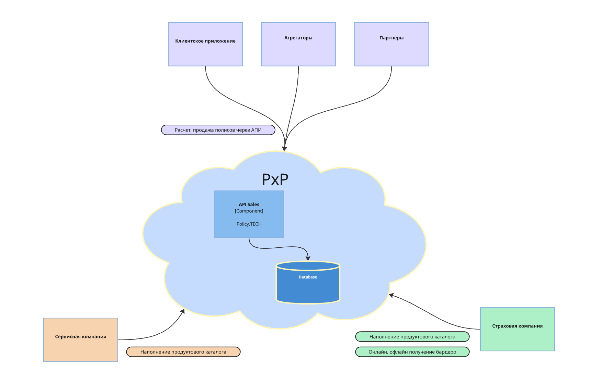

# PxP Policy.Tech Direct Insurance Platform

Платформа предназначена для **быстрого запуска и масштабирования страховых и сервисных продуктов** через партнёрские каналы, агрегаторы и API-интеграции.

Система позволяет страховым компаниям, поставщикам услуг и партнёрам работать в единой экосистеме:
создавать продукты, рассчитывать тарифы, продавать полисы и доставлять оформленные договоры в страховые системы.

Платформа ориентирована на **direct-продажи, embedded insurance и партнерские каналы**.

---

# Основные возможности

### Product Catalog

Гибкий каталог продуктов позволяет быстро создавать и настраивать:

* страховые продукты
* сервисные продукты
* дополнительные опции и подписки

Без разработки можно настроить:

* покрытия
* тарифные модели
* тарифные факторы
* правила расчета

Это позволяет **запускать новые продукты за часы, а не за месяцы разработки**.

---

### Rating Engine

Механизм расчета поддерживает различные модели тарификации:

* фиксированная премия
* процент от страховой суммы
* тарифные таблицы
* формулы расчета

Расчет может выполняться **в реальном времени через API**.

---

### API Distribution

Партнеры и агрегаторы могут:

* рассчитывать стоимость продукта
* оформлять страховые полисы
* подключать дополнительные сервисы

через REST API.

Это позволяет интегрировать страхование в:

* маркетплейсы
* e-commerce
* банковские приложения
* сервисные платформы

---

### Document Generation

Платформа автоматически формирует документы:

* страховой полис
* сертификат страхования
* дополнительные документы

Печатные формы настраиваются через шаблоны и генерируются **в момент оформления полиса**.

---

### Delivery to Insurance Systems

Проданные полисы могут автоматически передаваться в страховую компанию:

* через API интеграцию
* через регулярные отчеты
* через выгрузки данных

Это позволяет использовать платформу **без изменения основной страховой системы**.

---

### Partner Management

Платформа позволяет:

* управлять партнёрами и каналами продаж
* выдавать API-доступ
* ограничивать доступ к продуктам
* контролировать продажи

---

### Cross-sales

Платформа поддерживает продажу **нестраховых продуктов** вместе со страховками:

* сервисные услуги
* подписки
* дополнительные сервисы

---

# Участники платформы

## Страховая компания

Страховая компания использует платформу для:

* управления продуктовым каталогом
* настройки тарифов
* подключения интеграций
* запуска новых продуктов
* управления партнёрскими продажами

---

## Поставщики услуг

Поставщики могут публиковать сервисные продукты и дополнительные услуги, которые могут продаваться вместе со страхованием.

---

## Партнёры и агрегаторы

Партнеры используют API платформы для:

* расчета стоимости продуктов
* оформления страховок
* продажи дополнительных сервисов

---

# Как работает платформа

Общий процесс взаимодействия выглядит следующим образом:

1. Страховая компания настраивает продукт
2. Партнер подключается к API платформы
3. Партнер выполняет расчет стоимости
4. Клиент покупает продукт
5. Платформа формирует документы
6. Полис передается в страховую систему

---

# Архитектура

Платформа состоит из нескольких ключевых подсистем:

* Product Catalog
* Rating Engine
* Partner API
* Document Service
* Integration Service

  

---

# Документация

Дальнейшая документация включает:

* модель страхового продукта
* руководство по настройке продуктов
* описание API
* архитектуру платформы
* интеграции
