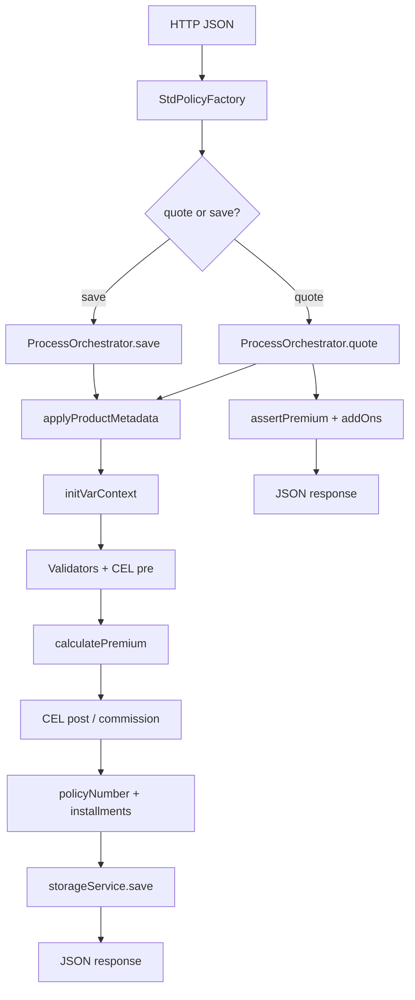

# Создание договора: quote и save

Запрос приходит на эндпоинт `POST /api/v1/{tenantCode}/sales/quotes` или `.../policies` (целевой вариант — `/{format}/quote`, `/{format}/save`).

Для формата выбирается маппер (`StdPolicyFactory` → `StdPolicyMapper`), wire JSON оборачивается в **`StdPolicy`** — внутреннее представление договора для оркестратора.

`StdPolicy` содержит get/set для системных полей (`id`, `statusCode`, `policyNumber`, `premium`, даты, `commission`, …) и domain-view (`insuredObjects`, `covers`, …).  
Параллельно держится wire-документ (`PolicyDTO`) и **runtime vars** — `VariableContext` / `CalculatorContext`: справочник переменных из настроек продукта (`PvVar`), значения materialize из JSON по `varPath` (JsonPath).

Итого на входе процесса: **`StdPolicy` + JSON + список vars продукта**.

Далее по `stdPolicy.getProductCode()` поднимаются метаданные продукта: даты, пакет, обязательные/опциональные покрытия, правила (`insuredEqualsPolicyHolder`, …).  
`PreProcessService.applyProductMetadata` нормализует даты, дополняет `covers[]`, при необходимости копирует страхователя в объект страхования.

Подробнее: [POLICY_QUOTE_SAVE.md](../../PoliTechAPI/docs/POLICY_QUOTE_SAVE.md), wire-adapters: [POLICY_WIRE_ADAPTERS.md](../../PoliTechAPI/docs/POLICY_WIRE_ADAPTERS.md).

---

## Точка входа

```
SalesController
  stdPolicyFactory.build(format, requestBody)  →  StdPolicy
  processOrchestrator.quote(stdPolicy)       →  quote
  processOrchestrator.save(stdPolicy)        →  save
  stdPolicy.toJson()                         →  ответ клиенту
```

Класс оркестратора: `ProcessOrchestratorService` (`pt-process`).  
Общие шаги вынесены в `PolicyProcessSupport`.

---

## Quote — порядок вызовов

| # | Кто | Метод | Что делает |
|---|-----|--------|------------|
| 1 | Controller | `StdPolicyFactory.build` | wire JSON → `StdPolicy` |
| 2 | Orch | `quote(stdPolicy)` | |
| 3 | Support | `requireDataScope(user)` | DEV / PROD из профиля пользователя |
| 4 | Support | `normalizeForProcess(policy, QUOTE, dataScope)` | `processList`, сброс `id`/`premium`/`policyNumber`, `statusCode` → QUOTE |
| 5 | Support | `loadProduct(tenant, productCode, dataScope)` | `ProductVersionModel` из БД |
| 6 | Orch | `authorizationService.check` | PRODUCT + **QUOTE** |
| 7 | Support | `applyProductMetadata` | см. блок ниже |
| 8 | Support | `resolveCommission` / `validateRequestedCommission` | проверка запрошенной КВ |
| 9 | Support | `initVarContext(policy, product)` | `policy.setVars(product)` → `VariableContextImpl` из JSON + vars продукта |
| 10 | Orch | `validatorService.validate(QUOTE)` | валидаторы продукта |
| 11 | Orch | `runCelValidation(PRE_QUOTE_VALIDATION)` | CEL pre-quote |
| 12 | Orch | **`calculatePremium`** | калькулятор, премия, покрытия (см. ниже) |
| 13 | Orch | `runCelValidation(POST_QUOTE_VALIDATION)` | CEL post-quote |
| 14 | Support | `applyDigests` | `ph_digest`, `io_digest` → `processList` |
| 15 | Support | `calculateCommission` | расчёт комиссии по премии |
| 16 | Orch | `stdPolicy.setCommission` | |
| 17 | Support | `assertPositivePremium` | премия > 0 |
| 18 | Support | `stripProcessListForProdResponse` | PROD: убрать `processList`; DEV: положить `varCtx.getValues()` |
| 19 | Orch | `policyAddOnService.checkRequestedAddOns` | кросс-продукты / add-ons |
| 20 | Orch | `return stdPolicy` | → `toJson()` в контроллере |

**В БД quote не пишется.**

---

## Save — порядок вызовов

| # | Кто | Метод | Что делает |
|---|-----|--------|------------|
| 1–4 | | как в quote | `processList` = **SAVE** |
| 5 | Support | `loadProduct` | |
| 6 | Orch | `authorizationService.check` | PROD: **POLICY SELL** + **PRODUCT SELL**; DEV — без SELL |
| 7–9 | | как в quote | metadata, commission, `initVarContext` |
| 10 | Orch | `validatorService.validate(QUOTE)` | |
| 11 | Orch | `validatorService.validate(SAVE)` | доп. валидаторы save |
| 12 | Orch | `runCelValidation(PRE_QUOTE_VALIDATION)` | |
| 13 | Orch | `runCelValidation(PRE_SAVE_VALIDATION)` | |
| 14 | Orch | **`calculatePremium`** | |
| 15 | Orch | `runCelValidation(POST_QUOTE_VALIDATION)` | |
| 16 | Support | `calculateCommission` + `setCommission` | **до** номера договора |
| 17 | Orch | `numberGeneratorService.getNextNumber` | `policyNumber` |
| 18 | Support | `applyDigests` | |
| 19 | Orch | `paymentService.createInstallments` | график платежей → `stdPolicy.setInstallments` |
| 20 | Orch | `runCelValidation(UNDERWRITING)` | при ошибках → `statusCode` = UNDERWRITING, иначе ISSUED |
| 21 | Orch | `storageService.save(stdPolicy)` | `policy_data` + `policy_index` |
| 22 | Orch | `stdPolicy.setProcessList(null)` | |
| 23 | Orch | `paymentService.save(tenant, policyId, installments)` | платежи в БД |
| 24 | Orch | `return stdPolicy` | |

**Нет:** `assertPositivePremium`, `stripProcessListForProdResponse`, `checkRequestedAddOns` (в текущем коде).

---

## `applyProductMetadata` (шаг 7)

`PolicyProcessSupport.applyProductMetadata` → `PreProcessService.applyProductMetadata`:

1. `policy.setProductVersion`, `setProductName`
2. `normalizePolicyDates` — `issueDate`, `waitingPeriod` → `startDate`, `policyTerm` → `endDate` по правилам продукта
3. инициализация `insuredObjects[0]`, если пусто
4. если `insuredEqualsPolicyHolder` → `policy.copyPhtoInsObject()`
5. разрешение пакета (`packageCode`), подтягивание **обязательных** покрытий из `PvPackage`, лимиты/франшизы по конфигу продукта

Затем `attachInsurer` — страховщик из `insCompanyId` продукта.

---

## `initVarContext` (шаг 9)

```text
policy.setVars(product)
  → InsuranceContractPolicy.rebuildVariableContext()
  → JSON договора + PvVar продукта
  → VariableContextImpl.builder().json(...).productVersion(product).build()
  → materialize IN/VAR из JsonPath, MAGIC — по запросу в get()
```

Дальше калькулятор и CEL работают с **`CalculatorContext varCtx`**; изменения премии/дат — через сеттеры `StdPolicy` и `varCtx.put`.

---

## `calculatePremium` (внутри оркестратора)

| # | Метод | Действие |
|---|--------|----------|
| 1 | `addMandatoryVars` | для каждого cover: `co_{code}_sumInsured`, `_premium`, `_deductibleNr` в `varCtx` |
| 2 | `calculatorService.getCalculator` | модель тарифа по product + package |
| 3 | `calculatorService.runCalculator` | формулы → `varCtx` |
| 4 | `postProcessService.setCovers` | vars → domain `Cover` (премия, СС, франшиза) |
| 5 | `varCtx.getDecimal("pl_premium")` или сумма `cover.premium` | `stdPolicy.setPremium` |
| 6 | `io_sumInsured` → `insuredObject.setSumInsured` | |

---

## Quote vs save (кратко)

| | Quote | Save |
|---|-------|------|
| Авторизация PROD | PRODUCT QUOTE | POLICY SELL + PRODUCT SELL |
| Валидация SAVE | нет | да |
| CEL PRE/POST SAVE | нет | да |
| Номер договора | нет | `NumberGeneratorService` |
| Installments | нет | `PaymentService` |
| Статус ISSUED/UNDERWRITING | нет | да |
| Запись в БД | нет | `StorageService.save` |
| Add-ons | да | нет |
| `assertPositivePremium` | да | нет |
| `processList` в ответе | DEV — с vars | убирается перед ответом |

---

## Схема потока


