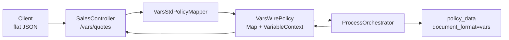

# Pre-project: плоский wire-формат `vars` (varCode → value)

См. также:
- [POLICY_WIRE_ADAPTERS.md](../../PoliTechAPI/docs/POLICY_WIRE_ADAPTERS.md) — pluggable форматы, `formatId`, URL
- [POLICY_QUOTE_SAVE.md](../../PoliTechAPI/docs/POLICY_QUOTE_SAVE.md) — поток quote/save
- [vars.md](../development/vars.md) — словарь переменных продукта
- [policy-execution-context-preproject.md](./policy-execution-context-preproject.md) — изоляция формата от оркестратора

---

## 1. Цель

Добавить **второй wire-формат** JSON для quote/save:

- тело запроса — **плоский объект** `{ "varCode": value, ... }`;
- ключи = **`varCode`** из словаря продукта / `mt_attribute_def` (не вложенный `productCode`, не JsonPath);
- значения сразу попадают в **`VariableContext`** без разбора иерархического договора;
- оркестратор, калькулятор, CEL, валидаторы — **без изменений** (работают с `StdPolicy` + `CalculatorContext`).

Типичный потребитель: простая интеграция (Postman, legacy-партнёр, внутренние скрипты), когда не нужен полный контракт `v3` / `INSURANCE_CONTRACT`.

---

## 2. As-is

### 2.1 Текущий формат `INSURANCE_CONTRACT` (`v3`)

```json
{
  "productCode": "NS_CLASSIC",
  "startDate": "2026-07-05T00:00:00+03:00",
  "insuredObjects": [
    { "packageCode": "0", "age": 35 }
  ]
}
```

| Этап | Механизм |
|------|----------|
| Парсинг | `InsuranceContractPolicy` → `PolicyDTO` |
| Контекст | `VariableContextImpl.builder().json(nestedJson).productVersion(...)` |
| Материализация IN | JsonPath по `PvVar.varPath` / `mt_attribute_def.var_path` |
| Ответ | сериализация `PolicyDTO` (вложенный JSON) |
| БД | `policy_index.document_format = INSURANCE_CONTRACT` |

**Минусы для интегратора:** нужно знать иерархию CDM, `insuredObjects[0]`, имена полей `code` vs `varCode`, JsonPath-фильтры.

### 2.2 Уже есть в коде

| Компонент | Статус |
|-----------|--------|
| `StdPolicy`, `StdPolicyMapper`, `StdPolicyFactory` | есть |
| `StdPolicyRegistry` | регистрация mapper по `formatId` |
| `ProcessOrchestrator.quote/save(StdPolicy)` | format-agnostic |
| `policy_index.document_format` | есть |
| `SalesController` | захардкожен `INSURANCE_CONTRACT` |
| `VariableContextImpl` | только режим `json` + JsonPath |

---

## 3. Предлагаемое имя формата

| Кандидат | Оценка |
|----------|--------|
| **`vars`** | **рекомендуется** — ясно: map переменных, не путать с `StdPolicy` |
| `flat` | понятно, но не говорит о семантике |
| `v0` | нейтрально, но неочевидная связь с `v3`; похоже на «устаревший» |
| `int` | **не рекомендуется** — путается с integer / internal |

### Принятое решение (предложение)

```text
formatId = "vars"
```

| Место | Значение |
|-------|----------|
| URL | `POST /api/v1/{tenant}/sales/vars/quotes` |
| `StdPolicy.getFormat()` | `vars` |
| `policy_index.document_format` | `vars` |
| Константа | `PolicyFormats.VARS` → `"vars"` |

Сосуществование с `v3` (будущее имя для `INSURANCE_CONTRACT`):

| formatId | Структура JSON | Материализация контекста |
|----------|----------------|--------------------------|
| `v3` | вложенный договор (`PolicyDTO`) | JsonPath |
| `vars` | плоский `{ varCode: value }` | прямой `put` в `VariableContext` |

---

## 4. Контракт формата `vars`

### 4.1 Запрос (quote / save)

```json
{
  "pl_productCode": "NS_CLASSIC",
  "pl_startDate": "2026-07-05T00:00:00+03:00",
  "pl_endDate": "2027-07-05T00:00:00+03:00",
  "pl_issueDate": "2026-07-05T12:00:00+03:00",
  "io_packageCode": "0",
  "io_age": 35,
  "io_sumInsured": 100000,
  "ph_firstName": "Иван",
  "ph_lastName": "Иванов"
}
```

Правила:

1. **Только листовые `varCode`** — как в `product.vars` / листьях `mt_attribute_def` с `var_type IN` (и опционально входные `VAR`, если партнёр передаёт).
2. **Имя ключа = `var_code`** из `mt_attribute_def`, не поле `code` (CDM-имя вроде `productCode`).
3. **Нет вложенности** — `OBJECT`-узлы (`policyHolder`, `insuredObjects`) в wire не передаются; только плоские поля `ph_*`, `io_*`, `pl_*`, `co_*`.
4. **Неизвестные ключи** — игнорировать (`ignoreUnknown`), логировать на `DEBUG` (как `PolicyDTO`).
5. **`null` и отсутствие ключа** — эквивалентно «не передано»; в контекст не кладётся.
6. **Типы** — по `var_data_type` продукта: `NUMBER` → number, `STRING` → string; даты — ISO-8601 строки (как сейчас в v3).

Обязательный минимум для старта quote:

- `pl_productCode` — иначе нельзя загрузить продукт.

Остальное — валидаторы продукта / CEL.

### 4.2 Ответ (после quote / save)

Тот же плоский формат: **все ненулевые переменные** из `CalculatorContext` после процесса.

```json
{
  "pl_productCode": "NS_CLASSIC",
  "pl_premium": 1250.50,
  "io_sumInsured": 100000,
  "pl_commRate": 15,
  "processList": { ... }
}
```

| Решение | v1 |
|---------|-----|
| `processList` в ответе | только при `dataScope=DEV` (как сейчас для v3) |
| Системные VAR (`pl_premium`, `pl_policyNumber`) | включать в плоский ответ |
| MAGIC / CALC / COEFFICIENT | включать, если материализованы в контексте |
| `null` | **не включать** (согласовано с фильтром `processList.vars`) |

### 4.3 Пример vs `mt_attribute_def`

| var_code | var_path (v3 / JsonPath) | ключ в `vars` |
|----------|--------------------------|---------------|
| `pl_productCode` | `productCode` | `pl_productCode` |
| `io_age` | `insuredObjects[0].age` | `io_age` |
| `ph_firstName` | `policyHolder.firstName` | `ph_firstName` |

Связь с метаданными: для формата `vars` в `mt_attribute_def` можно завести отдельный `document_id = 'VARS'` (шаблон OpenAPI / админка) **или** генерировать схему из `product.vars` без дублирования дерева.

---

## 5. To-be: архитектура



**Принцип:** `pt-process` не знает про плоский JSON. Новый класс — только на wire-границе.

### 5.1 Новые классы (pt-api / pt-adapter-vars или pt-api)

| Класс | Назначение |
|-------|------------|
| `VarsWirePolicy` | `implements StdPolicy`; хранит `Map<String,Object> wireVars` + `CalculatorContext` |
| `VarsStdPolicyMapper` | `getFormat() → "vars"`; `fromJson` / `toJson` |
| `VariableContextImpl.Builder.flatVars(Map)` | построение контекста **без JsonPath** |

### 5.2 Построение `VariableContext` (ключевое отличие)

**Сейчас (`v3`):**

```java
VariableContextImpl.builder()
    .json(nestedPolicyJson)
    .productVersion(product)
    .build();
// IN-переменные: JsonPath по varPath
```

**Новое (`vars`):**

```java
VariableContextImpl.builder()
    .flatVars(parsedMap)           // varCode → value напрямую
    .productVersion(product)
    .build();
// IN: значение из map по def.getCode(); jsonPath не используется
// MAGIC, COEFFICIENT, CALC, VAR — как сейчас при get/put
```

Алгоритм `build()` в режиме `flatVars`:

1. Загрузить definitions из `product.vars` (+ LOB merge, как сейчас).
2. Для каждого `def` с `sourceType == IN`: если `flatVars.containsKey(def.code)` → `put` с приведением типа.
3. Не вызывать `JsonPath.read`.
4. `materializeMagicVars()` — при первом `getValues()` / по запросу.

### 5.3 `VarsWirePolicy` и оркестратор

Оркестратор читает typed-поля через `StdPolicy`:

| Метод | Источник в `vars` |
|-------|-------------------|
| `getProductCode()` | `wireVars.get("pl_productCode")` или `varCtx.getString("pl_productCode")` |
| `setPremium()` | `wireVars` + `varCtx.put("pl_premium", ...)` |
| `getInsuredObjects()` | **v1: синтетический список из 1 IO** или lazy-view из `io_*` vars |

**Вариант v1 (минимальный):** не реализовывать полноценный `List<InsuredObject>` — оркестратор уже использует `varCtx` для премии/лимитов; методы `getInsuredObjects()` возвращают stub/пустой список, если все данные в vars.  
**Вариант v1.1:** собирать один `InsuredObject` из префикса `io_*` для post-process покрытий.

`setVars(ProductVersionModel)`:

```java
variableContext = VariableContextImpl.builder()
    .flatVars(wireVars)
    .productVersion(product)
    .build();
```

`toJson()`:

```java
// все non-null из varCtx.getValues(); опционально minus processList для PROD
```

### 5.4 Хранение в БД

| Колонка | Значение |
|---------|----------|
| `policy_data.policy` | плоский JSON (как пришёл + обогащённый после save) |
| `policy_index.document_format` | `vars` |

Чтение: `StdPolicyRegistry.fromStorage()` → `VarsStdPolicyMapper.fromJson()`.

**Миграция v3 ↔ vars:** вне scope v1 (отдельная утилита / endpoint convert).

---

## 6. HTTP API

### 6.1 Новые эндпоинты

```text
POST /api/v1/{tenantCode}/sales/vars/quotes
POST /api/v1/{tenantCode}/sales/vars/policies
GET  /api/v1/{tenantCode}/sales/vars/policies/{policyNumber}   // фаза 2
```

### 6.2 Обратная совместимость

```text
POST /api/v1/{tenant}/sales/quotes     → formatId = INSURANCE_CONTRACT (позже v3)
POST /api/v1/{tenant}/sales/vars/quotes → formatId = vars
```

Альтернатива (фаза 2): единый path `/{formatId}/quotes` из [POLICY_WIRE_ADAPTERS.md](../../PoliTechAPI/docs/POLICY_WIRE_ADAPTERS.md).

### 6.3 Swagger

```java
@Schema(
    type = "object",
    description = "Плоский договор: ключи = varCode продукта",
    additionalProperties = true,
    example = "{\"pl_productCode\":\"NS_CLASSIC\",\"io_age\":35}"
)
```

Динамическая схема per product: `GET .../products/{id}/versions/{v}/example_vars` — генерация из `product.vars` (аналог `example_quote`).

---

## 7. Валидация и ошибки

| Ситуация | HTTP | Поведение |
|----------|------|-----------|
| Не JSON / не object | 400 | `invalidFormat` |
| Нет `pl_productCode` | 422 | `missingRequired` |
| Неизвестный `varCode` | — | игнор (v1) |
| Неверный тип (`"abc"` для NUMBER) | 422 | `validationFailed` на поле |
| Коэффициент не найден | 400 | уже есть `coefficientNotFound` |
| Неподдерживаемый `formatId` | 422 | `unsupported policy format` |

---

## 8. `mt_attribute_def` и админка

### 8.1 Роль метаданных

| Использование | v3 | vars |
|---------------|----|------|
| `var_path` | JsonPath в nested JSON | **не используется** на wire |
| `var_code` | внутренний код | **имя поля в JSON** |
| `var_data_type` | приведение типа | приведение типа |
| `var_type` | IN / VAR / MAGIC / … | IN принимается в запросе; остальные — только в ответе |
| `code` (CDM) | имя в nested JSON | **не используется** в wire `vars` |

### 8.2 Опционально: `document_id = 'VARS'`

Отдельное дерево в `mt_attribute_def` для документации / OpenAPI flat-схемы — **копия листьев** `INSURANCE_CONTRACT` с `var_path = var_code`.

Не блокирует v1: достаточно `product.vars` при runtime.

### 8.3 SchemaService

Расширить `SchemaService`:

```text
generateFlatExample(documentId, productCode, varValues) → JSON
```

Ключи = `varCode` для всех листьев с `var_type IN`.

---

## 9. План реализации

### Фаза 1 — MVP (quote/save)

| # | Задача | Модуль |
|---|--------|--------|
| 1 | `VariableContextImpl.Builder.flatVars(Map)` | pt-api |
| 2 | `VarsWirePolicy`, `VarsStdPolicyMapper` | pt-api |
| 3 | Bean `VarsStdPolicyMapper` в `StdPolicyConfiguration` | pt-process |
| 4 | `SalesController`: `/vars/quotes`, `/vars/policies` | pt-launcher |
| 5 | `toJson()` / storage с `document_format=vars` | pt-api, pt-db |
| 6 | Тест: bootstrap product + flat JSON → premium | pt-process / integration |

### Фаза 2

| # | Задача |
|---|--------|
| 7 | `GET /vars/policies/{nr}` |
| 8 | `example_vars` в ProductController |
| 9 | Унификация URL `/{formatId}/quotes` |
| 10 | `document_id=VARS` в метаданных + Redoc |

### Фаза 3 (опционально)

| # | Задача |
|---|--------|
| 11 | Конвертер `v3` ↔ `vars` |
| 12 | Вынести в `pt-adapter-vars` JAR |
| 13 | Переименование `INSURANCE_CONTRACT` → `v3` в БД |

---

## 10. Риски и ограничения

| Риск | Митигация |
|------|-----------|
| Несколько `insuredObjects` | v1: один IO; multi-IO — суффиксы `io_[0]_age` (фаза 3) или оставить v3 |
| Покрытия `co_*` динамические | плоский формат поддерживает любые `varCode` из продукта |
| Дублирование с `processList.vars` в DEV | тот же набор ключей; `processList` можно упростить для `vars` |
| Печатные формы / файлы | читают `VariableContext` — работают, если vars материализованы |
| Размер ответа | много VAR после расчёта; фильтр: только `product.vars` ∪ ненулевые |

---

## 11. Критерии приёмки

1. `POST .../vars/quotes` с плоским JSON и `pl_productCode` возвращает 200 и `pl_premium` в том же flat-формате.
2. `POST .../vars/policies` сохраняет в БД с `document_format = vars`.
3. Повторное чтение полиса восстанавливает `VarsWirePolicy`.
4. Существующие `.../sales/quotes` (v3) **не ломаются**.
5. Отсутствие переменной условия коэффициента → 400, не 500.
6. `null`-значения не попадают в ответ.

---

## 12. Открытые вопросы

| # | Вопрос | Предложение |
|---|--------|-------------|
| 1 | Имя `vars` vs `v0` | **`vars`** |
| 2 | Игнорировать или отклонять неизвестные ключи | игнорировать (v1) |
| 3 | Включать ли `TEXT` vars в ответ | нет, только если материализованы |
| 4 | Multi-insured | отложить; v1 single IO |
| 5 | Хранить только flat или дублировать в v3 | только flat при `document_format=vars` |

---

## 13. Пример сквозного сценария

**Запрос:**

```http
POST /api/v1/demo/sales/vars/quotes
Content-Type: application/json

{
  "pl_productCode": "NS_CLASSIC",
  "io_packageCode": "0",
  "io_profession": "1",
  "io_sport": "0",
  "pl_startDate": "2026-07-05T00:00:00+03:00",
  "pl_policyTerm": "1y"
}
```

**Внутри:**

```text
VarsStdPolicyMapper.fromJson
  → VarsWirePolicy(wireVars)
  → normalizeForProcess
  → setVars(product)
  → VariableContextImpl(flatVars)   // без JsonPath
  → calculator / CEL / validators
  → toJson: wireVars ∪ computed vars (non-null)
```

**Ответ (фрагмент):**

```json
{
  "pl_productCode": "NS_CLASSIC",
  "pl_premium": 840.0,
  "io_packageCode": "0",
  "Kprof": 1.2
}
```
