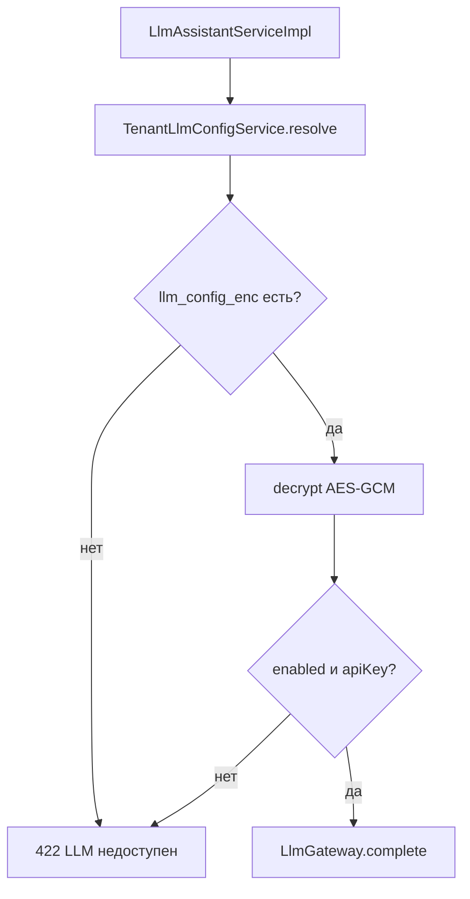

# Pre-project: настройки LLM на уровне tenant

См. также:
- [llm-integration-preproject.md](./llm-integration-preproject.md) — функциональная интеграция ассистента
- [vars.md](../development/vars.md) — словарь продукта

---

## 1. Цель

Перенести **все** операционные настройки LLM (провайдер, модель, API key, timeout) на **уровень tenant**:

- каждый тенант — свой ключ и провайдер;
- биллинг изолирован (украденный ключ одного tenant не списывает оплату другого);
- **нет platform default** — если у tenant нет настроенного LLM → сразу ошибка «LLM недоступен»;
- **секреты в БД только в зашифрованном виде** (API key — главный риск).

Промпты (`llm/prompts/*.txt`) и процессоры ответа **остаются в коде** (v1).

---

## 2. As-is: где хранятся настройки сейчас

### 2.1 Глобальный YAML

Файл: `PoliTechAPI/pt-launcher/src/main/resources/application.yml` → `app.llm`

```yaml
app:
  llm:
    enabled: true
    default-provider: routerai
    providers:
      routerai:
        api-key: sk-...   # plaintext в репозитории — недопустимо
```

Один конфиг на **весь инстанс** — все tenant'ы делят ключи.

### 2.2 Java

| Файл | Назначение |
|------|------------|
| `LlmProperties.java` | `@ConfigurationProperties(prefix = "app.llm")` |
| `LlmGateway.java` | читает глобальный конфиг |
| `OpenAiCompatibleLlmProvider.java` | `apiKey` из `LlmProperties.providers` |

### 2.3 Что уже per tenant

| Компонент | Tenant-scoped? |
|-----------|----------------|
| Вызов assist | да — `user.getTenantId()` |
| Журнал `llm_exchange` | да — `tid` |
| API keys | **нет** |

---

## 3. Принятые решения

| # | Решение |
|---|---------|
| 1 | **Platform default LLM не нужен.** Нет `app.llm.providers`, нет fallback на YAML. |
| 2 | **Нет конфига tenant → LLM недоступен.** Ошибка до вызова провайдера. |
| 3 | **В БД — только зашифрованный blob.** API key никогда в plaintext в PostgreSQL. |
| 4 | **Мастер-ключ шифрования** — только в env инстанса (`APP_SECRETS_MASTER_KEY`), не в git. |
| 5 | **GET API** — никогда не возвращает полный apiKey, только `apiKeyConfigured` + mask. |

---

## 4. To-be: модель данных

### 4.1 Колонка `acc_tenants.llm_config_enc`

```sql
ALTER TABLE acc_tenants
  ADD COLUMN llm_config_enc TEXT;   -- base64(AES-GCM ciphertext), NULL = LLM не настроен
```

`NULL` или пустая строка = **LLM недоступен** для tenant.

**Не хранить** открытый JSON с `apiKey` в JSONB — при утечке дампа БД ключи уйдут сразу.

### 4.2 Структура после расшифровки (in-memory only)

```json
{
  "enabled": true,
  "defaultProvider": "routerai",
  "defaultModel": "deepseek/deepseek-v4-flash",
  "timeoutMs": 120000,
  "providers": {
    "routerai": {
      "baseUrl": "https://routerai.ru/api/v1",
      "apiKey": "sk-tenant-specific-...",
      "defaultModel": "deepseek/deepseek-v4-flash"
    }
  }
}
```

Поля `baseUrl`, `defaultModel`, `timeoutMs` можно хранить в том же blob (шифруется весь JSON целиком — проще и безопаснее).

### 4.3 Шифрование

```
SecretEncryptionService (pt-auth или pt-api)
  algorithm: AES-256-GCM
  key:       APP_SECRETS_MASTER_KEY (32 bytes, base64 в env)
  format:    v1:<base64(nonce || ciphertext || tag)>
```

| Операция | Где |
|----------|-----|
| encrypt | при PUT admin API, перед save в БД |
| decrypt | при resolve config для LlmGateway |
| логи | **никогда** не писать apiKey, даже на TRACE |

Ротация ключа (v2): поле `keyVersion` в префиксе `v2:` + поддержка двух master keys при миграции.

### 4.4 Resolve без fallback

```
TenantLlmConfigService.resolve(tenantId):
  1. llm_config_enc из acc_tenants
  2. если null/blank → throw LlmUnavailableException("LLM недоступен")
  3. decrypt → TenantLlmConfig
  4. если enabled=false → throw LlmUnavailableException
  5. если нет apiKey для defaultProvider → throw LlmUnavailableException
  6. return EffectiveLlmConfig
```



**Исключение:** `LlmUnavailableException` → HTTP **422** или **503** с телом:

```json
{
  "message": "LLM недоступен. Настройте интеграцию в параметрах тенанта.",
  "domain": "LLM",
  "reason": "NOT_CONFIGURED"
}
```

### 4.5 Удаление `app.llm` из runtime

| Компонент | Действие |
|-----------|----------|
| `application.yml` → `app.llm` | **удалить** (или оставить только deprecated-комментарий на время миграции) |
| `LlmProperties` | **удалить** или свести к константам в коде (`DEFAULT_TIMEOUT_MS`) |
| `LlmGateway` | принимает `EffectiveLlmConfig` от tenant resolver |
| `OpenAiCompatibleLlmProvider` | `complete(request, ProviderConfig, timeoutMs)` — config из аргумента |
| `LlmAssistantServiceImpl` | `configService.resolve(user.getTenantId())` в начале assist |

---

## 5. HTTP API (admin)

```
GET  /api/v1/{tenantCode}/admin/tenant/llm-config
PUT  /api/v1/{tenantCode}/admin/tenant/llm-config
POST /api/v1/{tenantCode}/admin/tenant/llm-config/test
```

Права: `SYS_ADMIN` / `TENANT_ADMIN`.

**GET** — расшифровать, отдать DTO **без** полного ключа:

```json
{
  "enabled": true,
  "defaultProvider": "routerai",
  "defaultModel": "deepseek/deepseek-v4-flash",
  "timeoutMs": 120000,
  "configured": true,
  "providers": {
    "routerai": {
      "baseUrl": "https://routerai.ru/api/v1",
      "defaultModel": "deepseek/deepseek-v4-flash",
      "apiKeyMasked": "sk-***4wwu",
      "apiKeyConfigured": true
    }
  }
}
```

**PUT** — принять DTO, зашифровать целиком, записать в `llm_config_enc`.

- `apiKey` omitted / `"***"` / содержит `***` → сохранить прежний ключ из БД (merge).
- `enabled: false` → сохранить blob, но assist будет отвечать «LLM недоступен».

**PUT `/api-key`** — заменить ключ одного провайдера без merge остальных полей.

```
PUT /api/v1/{tenantCode}/admin/tenant/llm-config/api-key
{ "providerCode": "routerai", "apiKey": "sk-new-key" }
```

### Жизненный цикл API key

| Сценарий | Действие |
|----------|----------|
| Первичная настройка | `PUT /llm-config` с полным `providers.routerai.apiKey` |
| Смена ключа | `PUT /llm-config/api-key` или `PUT /llm-config` с новым `apiKey` |
| Обновление baseUrl/model без смены ключа | `PUT /llm-config` без поля `apiKey` (или с mask `***`) |
| Проверка | `POST /llm-config/test` — minimal completion, ключ не логируется |

---

## 6. Безопасность

| Угроза | Митигация |
|--------|-----------|
| Утечка дампа БД | только ciphertext в `llm_config_enc` |
| Утечка через API | mask + never return full apiKey |
| Утечка через логи | запрет логирования apiKey; audit без секретов |
| Списание чужого счёта | ключ только per tenant, нет shared platform key |
| SQL injection / ORM leak | параметризованные запросы, decrypt только в service layer |
| Нет master key при старте | fail-fast: приложение не стартует без `APP_SECRETS_MASTER_KEY` в prod |

`llm_exchange` — по-прежнему логирует provider/model/tokens, **не** apiKey.

---

## 7. Миграция

1. Flyway: `llm_config_enc TEXT` на `acc_tenants`.
2. Реализовать `SecretEncryptionService` + тест round-trip.
3. Admin UI: ввод ключа tenant-админом → PUT → encrypt → DB.
4. **Ручная** миграция существующих tenant'ов: один раз ввести ключ через admin (не копировать из `application.yml` в скрипт).
5. Удалить `app.llm` и plaintext keys из `application.yml`.
6. Удалить `LlmProperties` / global provider wiring.

Для dev: tenant создаётся с пустым `llm_config_enc` → assist явно пишет «настройте LLM»; локально ключ вводится через admin или bootstrap-скрипт с encrypt.

---

## 8. Frontend

Секция «LLM» в настройках tenant:

- toggle «Включён»
- провайдер, base URL, model
- API key (password field, не показывать после save)
- «Проверить подключение»
- если `configured=false` — баннер «LLM недоступен» на экранах assist

`llm.service.ts` (assist): обработать 422 `NOT_CONFIGURED` → понятное сообщение пользователю.

---

## 9. План внедрения

### Фаза A — Crypto + storage

- [x] `SecretEncryptionService` (AES-256-GCM, `APP_SECRETS_MASTER_KEY`)
- [x] Миграция `llm_config_enc`
- [x] `TenantLlmConfig` DTO, encrypt/decrypt mapper
- [x] `LlmUnavailableException`

### Фаза B — Runtime

- [x] `TenantLlmConfigService.resolve(tenantId)` — strict, no fallback
- [x] Рефакторинг `LlmGateway`, providers — убрать `LlmProperties`
- [x] `LlmAssistantServiceImpl` — resolve перед каждым вызовом
- [x] Удалить `app.llm` из YAML

### Фаза C — Admin API + UI

- [x] GET/PUT/test/api-key с mask
- [x] Экран настроек tenant (вкладка LLM)
- [x] Обработка ошибки на фронте assist

### Фаза D — v2 (опционально)

- [ ] Квоты `maxTokensPerDay`
- [ ] Ротация master key

---

## 10. Оценка

| Фаза | Оценка |
|------|--------|
| A | 2–3 дня |
| B | 2 дня |
| C | 2–3 дня |
| **Итого** | **~1–1.5 недели** |

---

## 11. Риски

| Риск | Митигация |
|------|-----------|
| Потеря master key | backup в secrets manager; документация recovery |
| Tenant без LLM после миграции | явная ошибка + admin UI |
| Производительность decrypt | кэш `EffectiveLlmConfig` per tenantId, TTL 5 min, evict on PUT |

---

## 12. Карта файлов

| Удалить / deprecate | Добавить |
|---------------------|----------|
| `app.llm` в `application.yml` | `llm_config_enc` на `acc_tenants` |
| `LlmProperties` (global) | `SecretEncryptionService` |
| global api-key в YAML | `TenantLlmConfigService` |
| | `LlmUnavailableException` |
| | `TenantLlmConfigAdminController` |
| `LlmGateway` (refactor) | decrypt-on-read only |
